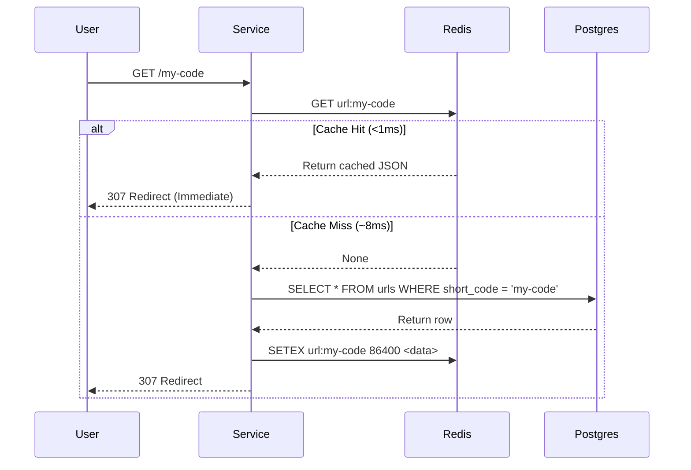
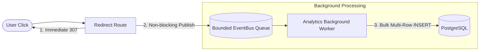

# 🧠 System Design Deep Dive — Complete Concept Guide

This document is a comprehensive, deep-dive reference explaining every system design pattern, architectural trade-off, and implementation detail used in this project.

---

## Table of Contents
1. [API Design & REST Principles](#1-api-design--rest-principles)
2. [Database Architecture & Data Layer](#2-database-architecture--data-layer)
3. [Caching Strategies & Performance](#3-caching-strategies--performance)
4. [Rate Limiting & Security Defenses](#4-rate-limiting--security-defenses)
5. [Asynchronous Processing & Event-Driven Telemetry](#5-asynchronous-processing--event-driven-telemetry)
6. [Observability & Fault Tolerance](#6-observability--fault-tolerance)
7. [Scaling & High Availability](#7-scaling--high-availability)

---

## 1. API Design & REST Principles

### 1.1 HTTP Status Codes — Why Precision Matters
In production systems, clients (frontends, mobile apps, third-party services) rely on HTTP status codes to decide what to do next without having to parse error text.

| Status Code | Meaning | When to Use in This System |
|---|---|---|
| `200 OK` | Request succeeded | `GET` details, `GET` list, `DELETE` confirmation. |
| `201 Created` | New resource created | `POST /api/v1/shorten` returns the newly created short URL. |
| `307 Temporary Redirect` | Redirect with method preserved | `GET /{short_code}` redirects to destination and enables click counting. |
| `400 Bad Request` | Client sent malformed/blocked data | SSRF attempts or invalid protocols. |
| `404 Not Found` | Resource does not exist | Short code not in DB or expired. |
| `409 Conflict` | Duplicate resource state | Custom short code already taken. |
| `422 Unprocessable Entity` | Pydantic validation failure | Missing required fields, URL length outside bounds. |
| `429 Too Many Requests` | Rate limit exceeded | Client exceeded tier quota (includes `Retry-After` header). |
| `503 Service Unavailable` | Dependency down | `/health/ready` probe when PostgreSQL or Redis is unreachable. |

### 1.2 301 Permanent Redirect vs. 307 Temporary Redirect
A critical system design interview question:

```
[Client] ---> 301 Permanent ---> Browser caches redirect locally ---> Next visit bypasses our server! (No analytics)
[Client] ---> 307 Temporary ---> Browser ALWAYS queries our server ---> Every click is captured & analyzed!
```

- **301 (Permanent Redirect)**: The browser caches the destination URL forever. Subsequent clicks do **not** hit our server.
  - *Pro*: Zero server load for future visits.
  - *Con*: Analytics are impossible because we never see subsequent clicks.
- **307 (Temporary Redirect)**: The browser is forced to query our server on every click.
  - *Pro*: We capture 100% of telemetry (IP, referrer, device, timestamp).
  - *Con*: Higher server traffic (which we handle with Redis Cache-Aside).

---

## 2. Database Architecture & Data Layer

### 2.1 B-Tree Indexing & Performance Math
Without an index on `short_code`, PostgreSQL must perform a **Full Table Scan ($O(N)$)**:

$$\text{For } 10,000,000\text{ URLs} \implies 10,000,000\text{ disk row comparisons per redirect!}$$

With a **B-Tree Index ($O(\log N)$)**:

$$\text{Comparisons} = \log_2(10,000,000) \approx 24\text{ lookups}$$

A reduction from **10 million operations to 24 operations** per redirect.

### 2.2 Connection Pooling (Engine Sizing)
Opening a PostgreSQL TCP connection requires a 3-way handshake, TLS negotiation, authentication, and memory allocation (~10ms).

A **Connection Pool** maintains persistent, pre-authenticated connections:
```
Request 1 ---> [ Borrow Connection #1 ] ---> Execute Query ---> [ Return to Pool ]
Request 2 ---> [ Borrow Connection #2 ] ---> Execute Query ---> [ Return to Pool ]
```

- `pool_size=5`: Always keep 5 open connections.
- `max_overflow=10`: Allow bursting up to 15 connections during traffic spikes.
- `pool_recycle=1800`: Recycle connections every 30 minutes to prevent stale socket leaks.
- `pool_pre_ping=True`: Test connection health before handing it to a request.

### 2.3 Atomic Updates vs. Race Conditions
When 2 users click the same link at the exact same millisecond:

**Naive Approach (Buggy Race Condition):**
1. Request A reads `count = 5`
2. Request B reads `count = 5`
3. Request A writes `count = 6`
4. Request B writes `count = 6` $\implies$ **One click is permanently lost!**

**Atomic SQL Update (Concurrency-Safe):**
```sql
UPDATE urls SET click_count = click_count + 1 WHERE short_code = :code;
```
The database handles this atomically in a single row lock—zero lost updates.

---

## 3. Caching Strategies & Performance

### 3.1 Cache-Aside Pattern (Lazy Loading)


### 3.2 Cache Invalidation & TTL (Time To Live)
1. **TTL (Time to Live)**: Every cached key expires automatically (e.g. 24h) to avoid orphaned memory.
2. **Explicit Invalidation**: When `DELETE /api/v1/urls/{code}` is called:
   - Step 1: Delete row from PostgreSQL.
   - Step 2: Delete key `url:{code}` from Redis.
   - Prevents users from accessing deleted links via stale cache.

### 3.3 Graceful Degradation
If Redis crashes or runs out of memory:
- The `URLCache` catches `RedisError`, logs a warning, and returns `None`.
- The application automatically falls back to querying PostgreSQL directly.
- **Rule**: *The system gets slower, but never crashes.*

---

## 4. Rate Limiting & Security Defenses

### 4.1 Sliding Window Log via Redis Sorted Sets (`ZSET`)
Why Fixed Window counters fail:
```
Window 1 [12:00:00 - 12:01:00]          Window 2 [12:01:00 - 12:02:00]
                 10 requests at 12:00:59 | 10 requests at 12:01:01
                 -------------------------------------------------
                 Total = 20 requests in 2 SECONDS! (Boundary burst attack)
```

**Sliding Window Log Algorithm (Implemented with Redis ZSET):**
1. Key: `ratelimit:{client_id}`
2. Score: Unix epoch timestamp ($T$).
3. Member: Unique Request UUID.
4. Step 1: `ZREMRANGEBYSCORE key 0 (T - 60)` $\implies$ Purge requests older than 60 seconds.
5. Step 2: `ZCARD key` $\implies$ Count requests in the exact sliding 60-second window.
6. Step 3: If `count < limit`, execute `ZADD key T <uuid>` and `EXPIRE key 60`.
7. Step 4: If `count >= limit`, return `HTTP 429 Too Many Requests`.

### 4.2 SSRF (Server-Side Request Forgery) Defense
Attackers try to shorten URLs pointing to internal resources to bypass firewalls:
- `http://169.254.169.254/latest/meta-data/` (AWS IAM credentials)
- `http://localhost:5432/` (PostgreSQL internal port)
- `http://10.0.0.1/admin` (Internal intranet)

**Defense Implementation in `app/core/security.py`:**
- Validates URL scheme is strictly `http` or `https`.
- Resolves hostname and verifies it is not in loopback (`127.0.0.0/8`, `localhost`) or private subnets (`10.0.0.0/8`, `172.16.0.0/12`, `192.168.0.0/16`, `169.254.0.0/16`).

---

## 5. Asynchronous Processing & Event-Driven Telemetry

### 5.1 Producer-Consumer Pattern


### 5.2 Why Batch Writes Matter
- **1,000 individual inserts**: 1,000 TCP packets + 1,000 database transaction commits + 1,000 disk syncs $\implies \approx 2,000\text{ms}$.
- **1 batch insert of 1,000 rows**: 1 TCP packet + 1 transaction commit + 1 disk sync $\implies \approx 15\text{ms}$ ($130\times\text{ faster}$).

---

## 6. Observability & Fault Tolerance

### 6.1 Distributed Tracing with Correlation IDs
- Every request is tagged with an `X-Correlation-ID`.
- If client provides one, it is preserved; otherwise, a UUID is generated.
- Injected into every log entry using Python `contextvars`.
- Returned in HTTP response header so users can quote the ID when reporting bugs.

### 6.2 Health Probes (Liveness vs. Readiness)
- **`/health/live`**: Checks if the Python process is alive (used by Docker/Kubernetes to restart crashed containers).
- **`/health/ready`**: Deep check executing `SELECT 1` on PostgreSQL and `PING` on Redis with millisecond latency metrics.

### 6.3 Circuit Breaker Pattern
```
      +---------+  5 consecutive failures  +------+
      | CLOSED  | -----------------------> | OPEN | (Fails fast in <0.1ms)
      +---------+                          +------+
           ^                                  |
           | 2 successful probe calls         | Cooldown timeout (10s)
           |                                  v
      +-----------+                      +-----------+
      | HALF_OPEN | <------------------- | HALF_OPEN |
      +-----------+                      +-----------+
```

---

## 7. Scaling & High Availability

### 7.1 Stateless Microservice Architecture
Our FastAPI application instances store **zero state** in local container memory:
- **Durable data** $\implies$ PostgreSQL
- **Ephemeral cache & rate limits** $\implies$ Redis
- **Load balancing** $\implies$ Nginx Round-Robin

Because instances are 100% stateless, we can scale from 1 to 50 replicas with a single command:
```bash
docker compose up --scale app=10 -d
```
