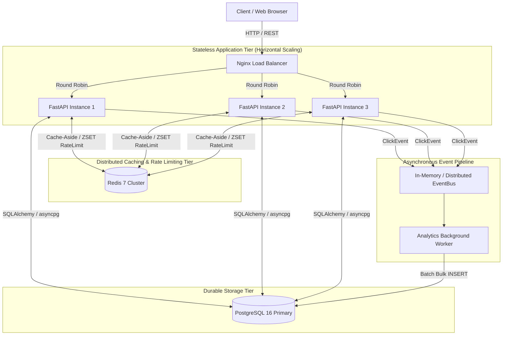

# 🏛️ System Design Architecture Document

## URL Shortener Service (High-Scale Production Design)

This document details the complete end-to-end architecture, capacity estimates, component interactions, and failure mitigation strategies for the URL Shortener Service.

---

## 1. High-Level System Architecture

---

## 2. Capacity & Scale Estimations

### Traffic Assumptions
- **Daily Active Users (DAU)**: $10\text{ Million}$
- **Read/Write Ratio**: $100:1$ (Read-heavy system)
- **New URLs Created / Day**: $1\text{ Million}$ writes/day
  $$\text{Write QPS} = \frac{1,000,000}{86,400} \approx 12\text{ writes/sec}$$
  $$\text{Peak Write QPS} = 12 \times 3 \approx 36\text{ writes/sec}$$
- **URL Redirects / Day**: $100\text{ Million}$ reads/day
  $$\text{Read QPS} = \frac{100,000,000}{86,400} \approx 1,160\text{ reads/sec}$$
  $$\text{Peak Read QPS} \approx 3,500\text{ reads/sec}$$

### Storage Estimations (5-Year Horizon)
- **Size per URL Record**:
  - `id`: $8\text{ bytes}$
  - `short_code`: $20\text{ bytes}$
  - `original_url`: $500\text{ bytes}$ (avg)
  - `created_at` / `expires_at`: $16\text{ bytes}$
  - `click_count`: $4\text{ bytes}$
  - Total per row $\approx 600\text{ bytes}$
- **5-Year Storage**:
  $$1,000,000\text{ URLs/day} \times 365\text{ days} \times 5\text{ years} = 1.825\text{ Billion URLs}$$
  $$\text{Total Storage} = 1.825\text{B} \times 600\text{ bytes} \approx 1.1\text{ TB}$$
  *(Fits easily on modern single-node PostgreSQL or standard RDS instances).*

### Memory (Redis Caching)
- Following the **Pareto 80/20 Rule**: 20% of the URLs generate 80% of the read traffic.
- Active daily cache working set:
  $$20\% \times 100\text{M} = 20\text{M cached URLs/day}$$
  $$\text{RAM Required} = 20\text{M} \times 600\text{ bytes} \approx 12\text{ GB RAM}$$

---

## 3. Core System Design Patterns Implemented

| Pattern | Layer | Purpose |
|---|---|---|
| **Clean Architecture** | Application | Decouples HTTP routes from business logic (`URLService`) and data access (`URLRepository`). |
| **Cache-Aside (Lazy Load)** | Caching | Checks Redis first; falls back to PostgreSQL on miss and populates cache. |
| **Sliding Window Log** | Security | Uses Redis Sorted Sets (`ZSET`) to eliminate fixed-window boundary burst spikes. |
| **Producer-Consumer** | Background Worker | Redirect routes publish telemetry asynchronously; worker consumes and bulk inserts to DB. |
| **Circuit Breaker** | Reliability | Detects downstream outages and fails fast (`CLOSED` -> `OPEN` -> `HALF_OPEN`). |
| **Reverse Proxy / Load Balancer** | Edge / Deployment | Nginx round-robins client requests across stateless application replicas. |
| **SSRF Defense** | Security | Validates and sanitizes URLs, blocking private IP ranges (`10.0.0.0/8`, `192.168.0.0/16`) and Cloud Metadata (`169.254.169.254`). |

---

## 4. Failure Modes & Mitigations

| Failure Mode | Impact | Mitigation Strategy |
|---|---|---|
| **Redis Cache Outage** | Cache lookups fail | **Graceful Degradation**: Application catches `RedisError` and transparently queries PostgreSQL. |
| **Database Overload** | DB connection pool exhausted | **Connection Pooling** with pre-ping, read replicas, and **Batch Bulk Writes** for telemetry. |
| **Sudden Traffic Spike** | Server memory exhaustion | **Bounded Queue Backpressure**: EventBus drops excess events rather than exhausting RAM. |
| **Single App Container Crash** | Lost traffic | **Nginx Upstream Health Checks**: Load balancer routes traffic only to healthy instances. |
| **Clock Drift across Nodes** | Timestamp mismatch | **Server-side Timestamps**: Generated at the database level via `func.now()`. |
